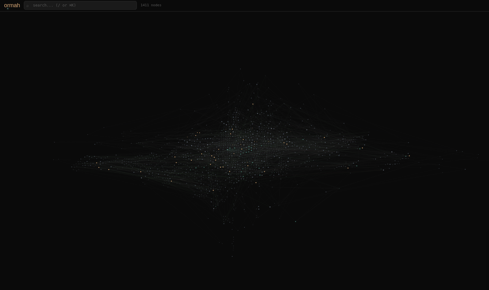

# Ormah

Ormah is the collective, self-maintaining memory layer all your agents can tap into.

The core idea is simple: memory should be involuntary. Your agents should not have to remember to remember. Ormah works in the background, learning your preferences, decisions, patterns, mistakes, and ongoing work, then whispering the right memory at the right time.

Your memory has always been yours. Ormah helps keep it that way.

Local. Private. Portable.
Yours to keep. Yours to move.

<p align="center">
  
</p>

The name comes from the Malayalam word ഓർമ (`ormah`), meaning "memory" or "remember."

## Memory Should Whisper

In real life, memory does not work like search. When something in front of you connects to something you already know, the memory surfaces on its own. You do not stop and decide to remember.

Ormah is built around that idea. Instead of waiting for an agent to ask for context, Ormah looks at what is happening and whispers the right memory before the agent processes the next prompt, so it starts with the context, preferences, constraints, and hints that matter.

That is what makes Ormah feel like memory instead of search. Search waits to be asked. Memory shows up when it matters.

Silence is better than noise. Ormah should whisper, not shout.

## Install

```bash
bash <(curl -fsSL https://ormah.me/install.sh)
```

One command gets you a working local Ormah runtime with setup for supported clients.

Ormah is agent-agnostic by design. It can be wired into any agent that exposes the right hook or prompt-injection path, and it also exposes CLI, MCP, and HTTP surfaces.

`ormah setup` will:

1. Start the Ormah server and install auto-start
2. Preload the local models used for search and whisper retrieval
3. Detect supported clients and wire them up automatically
4. Offer agent-backed maintenance when Claude Code or Codex are available
5. Offer transcript backfill to help bootstrap memory from earlier sessions

Today, setup can wire up:

- Claude Code
- Codex
- Claude Desktop (MCP)

Local search, embeddings, storage, the graph UI, and whisper retrieval do not require an API key. If you want Ormah's LLM-backed features to run independently of your agent, you can configure your own provider and API key.

## Features

### Recall and Whisper

Ormah supports both deliberate recall and involuntary recall.

When an agent knows it needs something, it can explicitly search memory. But memory should not always wait to be asked. Ormah is built to whisper the right memory at the right time, before the next prompt, so the agent starts with context instead of having to go looking for it.

Read more: [Whisper - Involuntary Recall](<docs/04 - Whisper - Involuntary Recall.md>), [Search and Ranking](<docs/03 - Search and Ranking.md>), [Affinity and Feedback](<docs/09 - Affinity and Feedback.md>)

### Memory Capture

Memory is only useful if it keeps growing with you.

Ormah can capture memory from ongoing sessions, stored transcripts, and external markdown sources. `whisper store` turns conversations into durable memory, the session watcher ingests completed sessions automatically, and Hippocampus watches note directories so project docs, journals, and markdown knowledge can flow into the graph over time.

Read more: [Hippocampus and Session Watcher](<docs/10 - Hippocampus and Session Watcher.md>), [Storage Layer](<docs/02 - Storage Layer.md>)

### Self-Maintaining Memory

Memory should not become a junk drawer.

Ormah continuously maintains the graph in the background: linking related memories, detecting contradictions, merging duplicates, consolidating overlap, scoring importance, and decaying stale context. Some of that work is automatic, and some of it can be delegated to an agent when judgment is required.

Read more: [Background Jobs](<docs/05 - Background Jobs.md>)

### Agent-Agnostic Surfaces

Ormah is not tied to a single agent.

It can integrate wherever there is a usable hook or interface. Ormah exposes multiple surfaces for that: hooks for whisper, MCP for tool-calling agents, a CLI for direct workflows, and an HTTP API for custom integrations. The memory layer stays the same even when the agent changes.

Read more: [MCP and Adapters](<docs/07 - MCP and Adapters.md>), [API Surface](<docs/08 - API Surface.md>), [Setup and Installation](<docs/11 - Setup and Installation.md>)

### Agent-Assisted or Independent

Ormah can use the intelligence of the agents you already work with, like Codex or Claude Code, for judgment-heavy tasks such as maintenance. But it does not have to depend on them. If you want Ormah to run those features independently, you can configure your own provider and API key.

Read more: [Configuration Reference](<docs/12 - Configuration Reference.md>), [Setup and Installation](<docs/11 - Setup and Installation.md>)

### Graph UI

Memory should be inspectable.

Ormah includes a graph UI so you can see what it knows, how memories connect, what is becoming central, and where conflicts or belief changes are forming. That makes the system easier to trust, debug, and improve.

Read more: [Web UI](<docs/14 - Web UI.md>)

## Why the whisper matters

This is the thing Ormah is built around.

In clients wired up with whisper hooks, before the model sees your prompt, Ormah decides what from your memory graph matters right now and quietly prepends just that context. Not a dashboard you have to open. Not a note you have to remember to paste. A whisper.

You usually never see it. Your agent just knows.

Whisper is available three ways:

- Hooks: `ormah setup` wires supported clients to run whisper automatically before each prompt
- CLI: `ormah whisper inject` and `ormah whisper store`
- HTTP: `POST /agent/whisper`

### Whisper inject

`ormah whisper inject` is the pre-prompt path for hook-supported clients.

Before each hooked prompt, Ormah:

1. Classifies the prompt intent
2. Runs hybrid retrieval across semantic search and keyword search
3. Spreads from direct hits across the graph to find related context
4. Reranks candidates for precision
5. Avoids repeating recently-whispered context when the topic has not shifted
6. Applies a relevance gate so silence beats noise

The result is a compact block of context added before the model sees your message.

On a fresh memory graph, whisper can also deliver a one-time first-session onboarding nudge so the agent asks a few useful identity and working-style questions before long-term personal context exists.

### Whisper store

`ormah whisper store` is the post-conversation path.

When a session compacts, ends, or reaches a configured extraction interval, Ormah can read the transcript, extract durable memories, deduplicate them, and add them to the graph. This is how your agent gradually learns your preferences, decisions, corrections, facts, and patterns over time.

Automatic transcript extraction uses an LLM. If you do not want that, Ormah still works as a local memory system and you can store memories explicitly with `remember` or `ormah remember`.

## The graph UI

Open `http://localhost:8787` and you can see the memory graph as a live force-directed visualization instead of treating memory as a black box.

The graph is not just decoration. It lets you inspect what the system knows, how memories connect, what is becoming central, and where contradictions or belief changes are forming.

The UI includes:

- Search with graph highlighting
- Filters for tier, type, space, and edge type
- A node detail panel with metadata and connections
- An insights view for contradictions and belief evolution
- A review queue for proposed merges and conflicts
- An admin panel for running or pausing background jobs

Identity-related nodes are rendered in teal, so your self node and the memories it defines are easy to spot.

## The knowledge graph

Ormah stores memories as typed nodes connected by typed edges.

### Node types

| Type | What it captures |
|------|-----------------|
| `fact` | Objective information |
| `decision` | Choices and their reasoning |
| `preference` | User preferences and working style |
| `event` | Things that happened |
| `person` | People and their roles |
| `project` | Project metadata and context |
| `concept` | Abstract ideas and mental models |
| `procedure` | How-to knowledge |
| `goal` | Objectives and intentions |
| `observation` | Patterns and insights noticed over time |

### Tiers

Memories live in three tiers:

- `core`: the highest-priority long-lived memories. This is where identity and the most durable facts tend to live. Ormah enforces a cap so core stays tight.
- `working`: active memories for current projects, ongoing collaboration, and recently useful context
- `archival`: faded but still searchable history

Identity and preference memories are marked with `about_self` metadata so `recall` and whisper can surface them when they are relevant.

### Edge types

| Edge | Meaning |
|------|---------|
| `supports` | Evidence or reasoning that strengthens another memory |
| `contradicts` | A tension or disagreement between two beliefs |
| `part_of` | Hierarchical containment |
| `defines` | Identity edges from the self node to preferences and traits |
| `evolved_from` | A newer belief superseded an older one |
| `depends_on` | Logical or practical dependency |
| `derived_from` | One memory was synthesized from another |
| `related_to` | General semantic relatedness |

### Confidence

Every memory carries a confidence score from `0.0` to `1.0`. Confident memories rank higher. Uncertain memories stay searchable but are surfaced more carefully.

### Spaces

Memories are automatically scoped to the project you are working in, usually from the git repo name. Current-project memories rank highest, then global identity memories, then other spaces.

## Bring your notes with Hippocampus

Hippocampus is Ormah's file watcher.

Point it at directories full of markdown and it will ingest them into memory automatically. This is useful for:

- Obsidian vaults and note exports
- Project docs and ADRs
- Journals and scratch notes
- Archived chat transcripts

It does a catch-up scan on startup, then watches for changes in real time.

### Hippocampus configuration

```env
# Comma-separated list of directories to watch
ORMAH_HIPPOCAMPUS_WATCH_DIRS=~/notes,~/obsidian/vault,~/Documents/journal

# Debounce delay before ingesting a changed file
ORMAH_HIPPOCAMPUS_DEBOUNCE_SECONDS=2.0

# Glob patterns to exclude
ORMAH_HIPPOCAMPUS_IGNORE_PATTERNS=**/templates/**,**/.trash/**

# Disable entirely
ORMAH_HIPPOCAMPUS_ENABLED=false
```

You can also trigger a manual scan from the admin panel.

## Self-maintenance

Ormah does not just collect memories. It keeps the graph healthy.

Background jobs:

- link related memories
- detect contradictions and belief evolution
- merge near-duplicates
- score importance from access, centrality, and recency
- decay stale memories with FSRS-style retrievability
- consolidate overlapping working memories
- assign spaces to orphaned memories
- refresh indexes incrementally

### Agent-in-the-loop maintenance

Some maintenance decisions need judgment. Ormah can delegate those to the agent you are already using.

Supported today:

- Claude Code
- Codex

More first-class agent integrations are planned.

When maintenance is enabled, whisper can append a `maintenance_due` signal. The installed `ormah-maintenance` agent can then run the two-call `run_maintenance` flow in the background without interrupting normal conversation. The automatic signal is opt-in during `ormah setup` and runs at most once every 24 hours by default.

You can also trigger maintenance manually:

- Claude Code native install: `/ormah-maintenance`
- Claude Code plugin: `/ormah:maintenance`
- Codex: the installed `ormah-maintenance` agent

`run_maintenance` uses a two-step flow:

1. Call it with no arguments to get four batches: link candidates, conflict candidates, merge candidates, and consolidation clusters.
2. Call it again with your decisions to apply new edges, merges, and consolidations.

## Integrations

Ormah is designed to work with both humans and agents through several surfaces.

### Supported clients today

- Claude Code native install: hooks, MCP, transcript backfill, session watcher support, maintenance agent
- Claude Code plugin: plugin-scoped hooks, MCP, setup/status/upgrade/maintenance commands, scope-aware guidance install
- Codex: hooks, MCP, maintenance agent
- Claude Desktop (macOS): MCP
- Any MCP-compatible client: memory tools
- Any local tool that can make HTTP requests: direct API access

### MCP

Primary MCP tools:

- `remember`
- `recall`
- `recall_node` — fetch full content and connections for a specific memory by ID
- `mark_outdated`
- `submit_feedback`
- `run_maintenance`

This is the main agent-facing surface for durable memory operations.

### HTTP API

The API runs at `http://localhost:8787`.

- `/agent/*`: remember, recall, whisper, feedback, maintenance
- `/admin/*`: job control, stats, review actions
- `/ingest/*`: conversation and file ingestion
- `/ui/*`: graph data, search, node details, insights

### CLI

The CLI is useful both for direct use and for hook-driven automation.

```bash
ormah setup                     # one-shot setup
ormah uninstall                 # remove integrations and data

ormah server start              # start server in foreground
ormah server start -d           # start server as a background service
ormah server stop               # stop background service
ormah server status             # check if the server is running

ormah remember "..."            # store a memory
ormah recall "query"            # search memories
ormah node <id>                 # inspect a specific memory
ormah outdated <id>             # mark a memory as outdated
ormah stats                     # show store statistics

ormah ingest <file>             # ingest a conversation log
ormah ingest-session <path>     # ingest a Claude Code JSONL transcript

ormah whisper inject            # pre-prompt whisper hook
ormah whisper store             # transcript extraction hook

ormah eval whisper run          # run whisper eval corpus
ormah eval whisper run --category preference --show-failures
ormah eval whisper run --simulate-session --preserve-self --json

ormah mcp                       # run MCP stdio server
```

### OpenAI function calling

If you are building on the OpenAI SDK, Ormah also exposes tool schemas in OpenAI-compatible format.

## LLM-backed features

Local retrieval does not need an API key. LLM-backed features are:

- transcript and conversation extraction
- graph maintenance decisions
- consolidation and conflict classification

You can run those features in different ways.

### Agent-backed maintenance

Ormah can use a supported coding agent for maintenance without a separate LLM API key.

Today that means Claude Code and Codex.

Enable the maintenance signal during `ormah setup` or set:

```env
ORMAH_CLAUDE_MAINTENANCE_ENABLED=true
```

If you are using Codex for automatic maintenance, `ormah setup` will also ask before enabling Codex's `multi_agent` feature in `~/.codex/config.toml`.

This covers maintenance decisions, not transcript extraction.

### Ollama

```bash
ollama pull llama3.2
```

```env
ORMAH_LLM_PROVIDER=ollama
ORMAH_LLM_MODEL=llama3.2
ORMAH_LLM_BASE_URL=http://localhost:11434
```

### LiteLLM

Use any provider supported by LiteLLM.

Anthropic:

```env
ORMAH_LLM_PROVIDER=litellm
ORMAH_LLM_MODEL=claude-haiku-4-5-20251001
ANTHROPIC_API_KEY=sk-ant-...
```

OpenAI:

```env
ORMAH_LLM_PROVIDER=litellm
ORMAH_LLM_MODEL=gpt-4o-mini
OPENAI_API_KEY=sk-...
```

Google Gemini:

```env
ORMAH_LLM_PROVIDER=litellm
ORMAH_LLM_MODEL=gemini/gemini-2.0-flash
GEMINI_API_KEY=...
```

### None

If you disable the LLM provider entirely, Ormah still works for local storage, search, whisper retrieval, MCP, CLI, and the graph UI. Automatic extraction and LLM-backed maintenance decisions will be unavailable.

```env
ORMAH_LLM_PROVIDER=none
```

## Configuration

Ormah reads `ORMAH_*` environment variables from `~/.config/ormah/.env` and local `.env` overrides.

Key settings:

```env
# Server
ORMAH_PORT=8787

# Embeddings (local by default)
ORMAH_EMBEDDING_MODEL=BAAI/bge-base-en-v1.5
ORMAH_EMBEDDING_DIM=768

# Search tuning
ORMAH_FTS_WEIGHT=0.4
ORMAH_VECTOR_WEIGHT=0.6
ORMAH_SIMILARITY_THRESHOLD=0.4

# Whisper
ORMAH_WHISPER_MAX_NODES=6
ORMAH_WHISPER_INJECTION_GATE=0.50
ORMAH_WHISPER_RERANKER_ENABLED=true

# FSRS decay
ORMAH_FSRS_INITIAL_STABILITY=1.0
ORMAH_FSRS_DECAY_THRESHOLD=0.3
ORMAH_FSRS_STABILITY_GROWTH=1.5
ORMAH_FSRS_MAX_STABILITY=365.0

# Background job intervals
ORMAH_AUTO_LINK_INTERVAL_MINUTES=1440
ORMAH_DECAY_INTERVAL_HOURS=24
ORMAH_CONFLICT_CHECK_INTERVAL_MINUTES=1440

# Core cap
ORMAH_CORE_MEMORY_CAP=50

# Space detection override
# ORMAH_SPACE=my-project

# Session watcher (Claude Code transcripts)
ORMAH_SESSION_WATCHER_ENABLED=false
```

## Architecture

```text
ormah/
  engine/          # memory engine, whisper, tiering, maintenance logic
  index/           # SQLite + vector + graph data
  store/           # markdown file store and watchers
  embeddings/      # hybrid retrieval and reranking
  background/      # jobs for linking, decay, conflicts, consolidation
  adapters/        # CLI, MCP, OpenAI, space detection
  agents/          # maintenance agent definitions
  commands/        # slash commands
  api/             # FastAPI routes for agents, admin, ingest, UI
  models/          # pydantic models
  transcript/      # session transcript parsing

ui/                # React + TypeScript graph UI
```

Memories are stored as markdown files with YAML frontmatter in `~/.local/share/ormah/memory/nodes/`. The SQLite database is a derived index and can be rebuilt from the markdown source of truth.

## Development

```bash
git clone https://github.com/r-spade/ormah.git
cd ormah
make install
uv run pytest
```

## License

MIT
