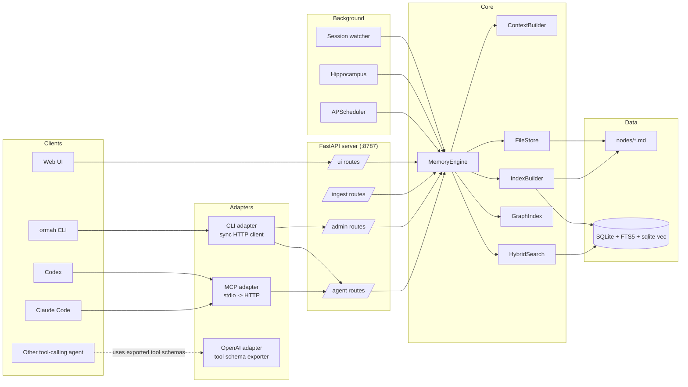

# Ormah Overview

Verified against the current repository state on 2026-04-12.

This page is the system map for Ormah. Read it when you want the shape of the runtime, where the main responsibilities live, and which deeper doc to open next.

At a high level, Ormah is a local-first memory system for agents. Markdown node files are the durable source of truth, SQLite and vector indexes are derived state, FastAPI is the operational center, and whisper plus maintenance logic sit on top of that core.

## System Shape



## How to Read This Diagram

- Clients reach Ormah through hooks, MCP, the CLI, the HTTP API, or the web UI.
- Adapters translate client-specific interactions into a small set of server routes.
- The FastAPI app is the runtime center. It wires the `MemoryEngine`, background jobs, and watchers together in [`src/ormah/main.py`](../src/ormah/main.py).
- Core components handle persistence, indexing, graph traversal, whisper building, and search.
- Markdown files are durable state. SQLite, FTS, and vector search are rebuildable derived indexes.

## Core System Assumptions

1. **Local-first**: memory data lives on the local machine.
2. **Markdown is the source of truth**: node files are durable; SQLite and vector indexes are rebuildable derivatives.
3. **Recall and whisper are the two main retrieval paths**: recall is deliberate memory lookup, while whisper surfaces relevant memory before the agent responds.
4. **Maintenance is split across runtime paths**: some work happens inline on writes, while background jobs and optional agent-backed maintenance clean up the graph over time.
5. **The core is agent-agnostic**: adapters and hooks can change without changing the storage and retrieval model.

## Runtime Boundaries

- **FastAPI** is the operational center. The app starts a `MemoryEngine`, background scheduler, hippocampus watchers, and the session watcher in [`src/ormah/main.py`](../src/ormah/main.py).
- **MemoryEngine** is the main facade. Routes delegate almost everything to it in [`src/ormah/engine/memory_engine.py`](../src/ormah/engine/memory_engine.py).
- **ContextBuilder** implements whisper selection and formatting in [`src/ormah/engine/context_builder.py`](../src/ormah/engine/context_builder.py).
- **FileStore** reads and writes markdown node files in [`src/ormah/store`](../src/ormah/store).
- **IndexBuilder** keeps the derived SQLite and vector index synchronized for Ormah-managed writes and rebuilds in [`src/ormah/index/builder.py`](../src/ormah/index/builder.py).
- **GraphIndex** exposes graph traversal, FTS search, and edge retrieval on top of SQLite.

## Startup and Shutdown

At startup the app:

1. creates `MemoryEngine`
2. calls `engine.startup()`
3. starts APScheduler background jobs
4. starts hippocampus watchers if enabled and watch dirs are configured
5. starts the session watcher if enabled

At shutdown it stops the session watcher, stops hippocampus observers, shuts down the scheduler, and closes engine resources.

## Storage Model

- Markdown node files are the durable source of truth.
- SQLite stores nodes, edges, tags, audit tables, whisper logs, affinity rows, proposals, merge history, and vector search state.
- Ormah-managed writes update both markdown and the derived index immediately.
- A standalone node-file watcher utility exists in [`src/ormah/store/watcher.py`](../src/ormah/store/watcher.py), but it is not wired into app startup today.

## Three Core Paths

This page keeps the runtime flows short. The linked docs go deeper into retrieval, ranking, storage, and maintenance behavior.

### Write Path

1. A client calls `/agent/remember`.
2. `MemoryEngine.remember()` writes a markdown node.
3. The node is indexed into SQLite and vector search.
4. Inline auto-linking may create initial edges.
5. The API returns formatted text plus the new node id.

Read more: [01 - Data Model](<./01 - Data Model.md>), [02 - Storage Layer](<./02 - Storage Layer.md>)

### Whisper Path

1. A supported client hook runs `ormah whisper inject`.
2. The CLI adapter posts to `/agent/whisper`.
3. The route builds a session-aware recent-prompt buffer.
4. `MemoryEngine.get_whisper_context()` delegates to `ContextBuilder.build_whisper_context()`.
5. Whisper searches, reranks, applies affinity and gating, formats the result, and may append `maintenance_due`.

Claude Code and Codex both install this hook path today.

Read more: [03 - Search and Ranking](<./03 - Search and Ranking.md>), [04 - Whisper - Involuntary Recall](<./04 - Whisper - Involuntary Recall.md>), [09 - Affinity and Feedback](<./09 - Affinity and Feedback.md>)

### Maintenance Path

The scheduler runs these background jobs from [`src/ormah/background/scheduler.py`](../src/ormah/background/scheduler.py):

- `importance_scorer`
- `index_updater`
- `duplicate_merger`
- `conflict_detector`
- `auto_linker`
- `auto_cluster`
- `consolidator`
- `decay_manager`

Separately, agent-backed maintenance can use `/agent/maintenance` for a two-phase human-or-agent-in-the-loop workflow.

Read more: [05 - Background Jobs](<./05 - Background Jobs.md>)

## Subsystem Map

```text
src/ormah/
├── adapters/      External interfaces: MCP, CLI, OpenAI schemas, space detection
├── api/           FastAPI routes and middleware
├── background/    Scheduler jobs, hippocampus, session watcher, LLM-backed maintenance logic
├── embeddings/    Encoders, vector store, hybrid search, reranker
├── engine/        MemoryEngine, whisper context builder, prompt classifier, affinity
├── index/         SQLite schema, graph helpers, index builder
├── models/        Pydantic request / domain models
├── store/         Markdown persistence and serialization
├── transcript/    Claude Code and Codex JSONL transcript parsing
├── cli.py         Unified end-user CLI
├── config.py      Environment-driven settings
├── main.py        FastAPI app + lifespan
├── server_manager.py
└── setup.py
```

Use this as a contributor map, not a replacement for the deeper subsystem docs.

## Where To Read Next

| To understand... | Read next |
| --- | --- |
| Persistence and node shape | [01 - Data Model](<./01 - Data Model.md>), [02 - Storage Layer](<./02 - Storage Layer.md>) |
| Retrieval and whisper behavior | [03 - Search and Ranking](<./03 - Search and Ranking.md>), [04 - Whisper - Involuntary Recall](<./04 - Whisper - Involuntary Recall.md>) |
| Maintenance and graph health | [05 - Background Jobs](<./05 - Background Jobs.md>), [09 - Affinity and Feedback](<./09 - Affinity and Feedback.md>) |
| Integration surfaces | [07 - MCP and Adapters](<./07 - MCP and Adapters.md>), [08 - API Surface](<./08 - API Surface.md>) |
| Ingestion | [10 - Hippocampus and Session Watcher](<./10 - Hippocampus and Session Watcher.md>) |

## Related Docs

- [01 - Data Model](<./01 - Data Model.md>)
- [02 - Storage Layer](<./02 - Storage Layer.md>)
- [03 - Search and Ranking](<./03 - Search and Ranking.md>)
- [04 - Whisper - Involuntary Recall](<./04 - Whisper - Involuntary Recall.md>)
- [05 - Background Jobs](<./05 - Background Jobs.md>)
- [07 - MCP and Adapters](<./07 - MCP and Adapters.md>)
- [08 - API Surface](<./08 - API Surface.md>)
