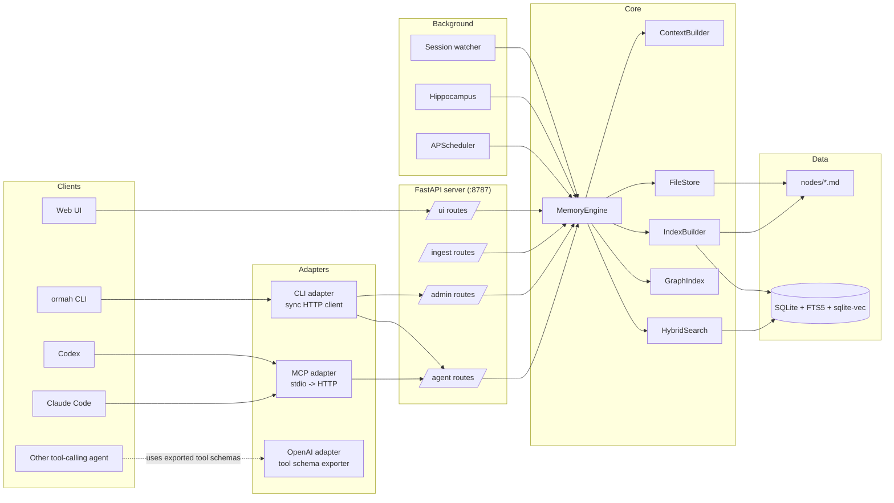

# Ormah - Architecture Overview

Verified against the current repository state on 2026-04-07.

Ormah is a local-first memory system for AI agents. It stores memories as markdown files, builds a derived SQLite index for search and graph traversal, and exposes the system through FastAPI, MCP, CLI commands, and a small web UI.

The core storage, indexing, retrieval, and maintenance model is agent-agnostic. Today, the most concrete integrations are Claude Code and Codex, but the system is structured so the same core can be used from other agent clients too.

## Design Philosophy

1. **Local-first**: memory data lives on the local machine.
2. **Markdown is the source of truth**: node files are persisted under the memory directory; SQLite and vector indexes are rebuildable derivatives.
3. **Whisper is the core feature**: the system can inject relevant memories before the agent answers.
4. **Maintenance is split across runtime paths**: some work happens inline on writes, while background jobs and optional agent-backed maintenance handle graph cleanup.
5. **Adapter-friendly**: MCP is the primary agent interface, while OpenAI-style tool schemas and a CLI adapter make the same core available elsewhere.

## High-Level Architecture



## Runtime Boundaries

- **FastAPI** is the operational center. The app starts a `MemoryEngine`, background scheduler, hippocampus watchers, and the session watcher in `src/ormah/main.py`.
- **MemoryEngine** is the main facade. Routes delegate almost everything to it.
- **ContextBuilder** implements whisper selection and formatting.
- **FileStore** reads and writes markdown node files.
- **IndexBuilder** keeps the derived SQLite / vector index synchronized for Ormah-managed writes and rebuilds.
- **GraphIndex** exposes graph traversal, FTS search, and edge retrieval on top of SQLite.

## Startup and Shutdown

At startup the app:

1. creates `MemoryEngine`
2. calls `engine.startup()`
3. starts APScheduler background jobs
4. starts hippocampus watchers if enabled and watch dirs are configured
5. starts the session watcher if enabled

At shutdown it stops the session watcher, stops hippocampus observers, shuts down the scheduler, and closes engine resources.

## Storage Model

- Markdown node files are the durable source of truth.
- SQLite stores nodes, edges, tags, audit tables, whisper logs, affinity rows, proposals, merge history, and vector search state.
- Ormah-managed writes update both markdown and the derived index immediately.
- A standalone node-file watcher utility exists in `src/ormah/store/watcher.py`, but it is **not** wired into app startup today.

## Main Request Flows

### Remember

1. client calls `/agent/remember`
2. `MemoryEngine.remember()` writes a markdown node
3. the node is indexed into SQLite / vector search
4. inline auto-linking may create initial edges
5. the API returns a formatted text response plus the node id

### Whisper

1. a supported client hook runs `ormah whisper inject`
2. CLI adapter posts to `/agent/whisper`
3. route builds a session-aware recent-prompt buffer
4. `MemoryEngine.get_whisper_context()` delegates to `ContextBuilder.build_whisper_context()`
5. whisper searches, reranks, applies affinity / gating, formats the result, and may append `maintenance_due`

Claude Code and Codex both install this hook path today.

### Background Maintenance

The scheduler runs:

- `importance_scorer`
- `index_updater`
- `duplicate_merger`
- `conflict_detector`
- `auto_linker`
- `auto_cluster`
- `consolidator`
- `decay_manager`

Separately, agent-backed maintenance can use `/agent/maintenance` for a two-phase human-or-agent-in-the-loop workflow.

## Project Structure

```text
src/ormah/
├── adapters/      External interfaces: MCP, CLI, OpenAI schemas, space detection
├── api/           FastAPI routes and middleware
├── background/    Scheduler jobs, hippocampus, session watcher, LLM-backed maintenance logic
├── embeddings/    Encoders, vector store, hybrid search, reranker
├── engine/        MemoryEngine, whisper context builder, prompt classifier, affinity
├── index/         SQLite schema, graph helpers, index builder
├── models/        Pydantic request / domain models
├── store/         Markdown persistence and serialization
├── transcript/    Claude Code and Codex JSONL transcript parsing
├── cli.py         Unified end-user CLI
├── config.py      Environment-driven settings
├── main.py        FastAPI app + lifespan
├── server_manager.py
└── setup.py
```

## Code Anchors

- `src/ormah/main.py` - app lifespan and startup wiring
- `src/ormah/engine/memory_engine.py` - main facade
- `src/ormah/engine/context_builder.py` - whisper pipeline
- `src/ormah/index/builder.py` - markdown -> SQLite sync
- `src/ormah/background/scheduler.py` - scheduled jobs
- `src/ormah/adapters/mcp_adapter.py` - MCP transport

## Related Docs

- [02 - Storage Layer](<./02 - Storage Layer.md>)
- [03 - Search and Ranking](<./03 - Search and Ranking.md>)
- [04 - Whisper - Involuntary Recall](<./04 - Whisper - Involuntary Recall.md>)
- [05 - Background Jobs](<./05 - Background Jobs.md>)
- [07 - MCP and Adapters](<./07 - MCP and Adapters.md>)
- [08 - API Surface](<./08 - API Surface.md>)
