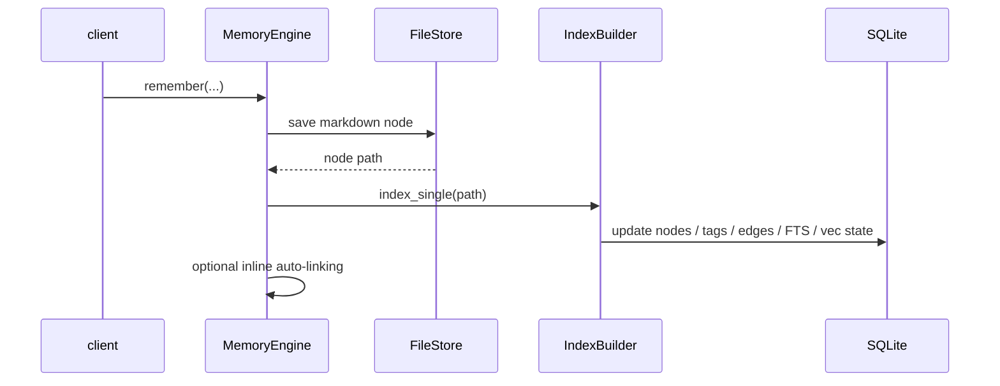

# Storage Layer

Verified against the current repository state on 2026-04-07.

Ormah uses a dual-storage model:

- markdown node files are the durable source of truth
- SQLite is a derived index for search, graph traversal, metadata, and operational logs

## Source of Truth vs Derived Index

The intended contract is:

1. write durable memory state to markdown
2. derive SQLite state from those markdown files
3. rebuild the SQLite side whenever necessary

That means markdown persistence is not just an export format. It is the canonical persisted node representation.

## Markdown Node Files

**Code**: `src/ormah/store/file_store.py`, `src/ormah/store/markdown.py`

Each memory node is stored as a markdown file under the configured memory directory.

Typical persisted fields include:

- id
- title
- content
- type
- tier
- space
- created / updated timestamps
- tags
- connections
- validity / decay-related metadata

`FileStore` handles:

- loading nodes from disk
- saving nodes atomically
- soft deletion
- path resolution

## SQLite Index

**Code**: `src/ormah/index/schema.sql`, `src/ormah/index/db.py`, `src/ormah/index/builder.py`

SQLite stores the derived operational view of memory.

Important table families:

- `nodes`
- `edges`
- `node_tags`
- FTS tables for full-text search
- vector-search storage used by `sqlite-vec`
- maintenance/audit tables such as `proposals`, `merge_history`, `audit_log`
- whisper / feedback tables such as `whisper_log`, `review_log`, `affinity`

## Index Builder

`IndexBuilder` is responsible for translating markdown node files into SQLite rows and search indexes.

Key responsibilities:

- full rebuild from markdown files
- indexing a single saved node
- incremental update of changed content
- removing deleted nodes from derived state

For normal Ormah-managed writes, the engine saves markdown and then updates the derived index immediately.

## Graph Access

**Code**: `src/ormah/index/graph.py`

`GraphIndex` reads from SQLite and provides:

- FTS search helpers
- graph neighbor lookup
- edge lookup
- whole-graph fetches for UI

## What Happens On `remember()`

## Rebuild Behavior

Because SQLite is derived, the index can be rebuilt from the markdown layer.

Operationally this happens through:

- `engine.rebuild_index()`
- `POST /admin/rebuild`
- startup / maintenance paths that invoke index-building logic

## Important Correction: Node File Watcher

There is a watcher implementation in:

- `src/ormah/store/watcher.py`

It can watch the node directory for `.md` changes and invoke a callback.

However, in the current app runtime this watcher is **not wired into startup**. `main.py` starts:

- APScheduler
- hippocampus observers
- session watcher observers

It does **not** start `store.watcher.start_watcher()`.

So this statement is not currently safe:

- "manual edits to node markdown automatically update SQLite"

Today, the reliable guarantee is narrower:

- Ormah-managed writes update both markdown and the derived index
- manual node-file edits can be picked up by rebuild/incremental index operations
- there is currently no app-started live node-file watcher for the node store itself

## Walkthrough Example

If you manually edit a node markdown file on disk:

1. the markdown file changes immediately
2. SQLite does **not** automatically update through a live node-store watcher
3. the change becomes visible to derived search state only after an index rebuild / update path processes it

This is different from hippocampus, which is a separate watcher for external content ingestion.

## Code Anchors

- `src/ormah/store/file_store.py`
- `src/ormah/store/markdown.py`
- `src/ormah/store/watcher.py`
- `src/ormah/index/schema.sql`
- `src/ormah/index/builder.py`
- `src/ormah/index/graph.py`
