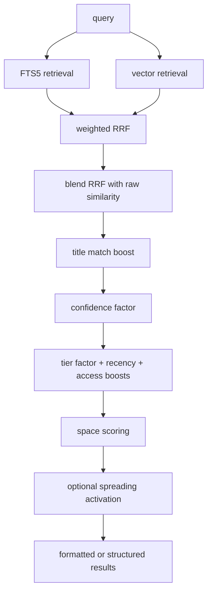

# Search and Ranking

Verified against the current repository state on 2026-04-07.

Ormah search is a hybrid pipeline that combines:

- FTS5 keyword retrieval
- vector similarity retrieval
- Reciprocal Rank Fusion
- post-retrieval score shaping
- optional graph-based spreading activation

## Main Search Path

**Code**: `src/ormah/embeddings/hybrid_search.py`, `src/ormah/engine/memory_engine.py`



## Candidate Pool Size

The search widens retrieval candidates like this:

- default: `3 x limit`
- with temporal filters (`created_after` / `created_before`): `10 x limit`

That widening is tied to temporal filtering, not to question detection.

## FTS + Vector Retrieval

### FTS

FTS search uses sanitized token queries and can inject `about_self` when identity-style tokens are present in the query.

### Vector

Vector search encodes the query, retrieves nearest neighbors, and drops candidates below `similarity_threshold`.

## Question Queries

Question-like queries still get special weighting:

- FTS weight scaled by `question_fts_weight_scale`
- vector weight scaled by `question_vector_weight_scale`
- similarity blend weight increased via `question_similarity_blend_weight`
- title match boost disabled for question queries

But the candidate-pool multiplier stays tied to temporal filters, not to question mode.

## Blend and Score Shaping

### 1. RRF + raw similarity blend

RRF captures ranking agreement between retrievers. Raw similarity restores magnitude.

Before raw vector similarity is blended back in, Ormah applies a **long-document penalty**:

- it looks up `length(content)` for candidate nodes
- if `content_len > length_penalty_threshold`, it scales raw similarity by:

```python
penalty = max(0.1, length_penalty_threshold / content_len)
raw_sim *= penalty
```

Current default:

- `length_penalty_threshold = 300`

Why this exists:

- long documents often get middling similarity to many different queries because their embeddings average over multiple topics
- without this penalty, broad architecture docs can outrank short, specific memories too easily

This penalty affects the **raw vector similarity contribution**, not BM25 / FTS ranking directly.

### 2. Title boost

Title overlap can increase score for non-question queries.

### 3. Confidence factor

Current multiplicative enrichment includes:

```python
confidence_factor = 0.4 + 0.6 * confidence
adjusted_score = base_score * confidence_factor
```

There is **no** separate multiplicative `importance_factor` in the current hybrid search implementation.

### 4. Tier, recency, and access

Current behavior:

- tier boost is implemented as a multiplicative factor on the adjusted score
- recency is an additive proportional bonus
- access is an additive proportional bonus using `log1p(count) / log1p(20)`

That means older docs describing tier as purely additive and access normalized by `50` are stale.

## Space Scoring

After hybrid search, `MemoryEngine._apply_space_scores()` rescales results:

- same project space: full score
- global (`space is None`): `space_boost_global`
- other space: `space_boost_other`

Current defaults:

- `space_boost_global = 1.0`
- `space_boost_other = 0.6`

## Spreading Activation

**Code**: `src/ormah/engine/memory_engine.py:_spread_activation()`

Search results can be enriched by traversing graph edges outward from the top seed hits.

Important implementation details:

- top `activation_seed_count` hits are used as seeds
- up to `activation_max_per_seed` neighbors are added per seed
- base activation uses `seed_score * edge_weight * edge_type_factor * activation_decay`

### Result labels

Activated results are labeled:

- `source="activated"` for normal edge traversal
- `source="conflict"` when reached via a `contradicts` edge

Older docs that describe these as `source="graph"` are inaccurate.

## Edge-Type Factors

Current edge-type factors include:

- `supports = 1.0`
- `related_to = 0.7`
- `contradicts = 0.4`

Note that the `0.4` here is an activation factor used during search enrichment. It is **not** the stored edge weight written by the conflict detector.

## Search Example

Prompt: `what database does ormah use?`

1. question mode is detected
2. FTS finds nodes mentioning database choices
3. vector search finds semantically similar architecture notes
4. RRF merges the ranked lists
5. raw similarity is blended back in
6. title match boost is disabled because this is a question
7. confidence, tier, recency, and access adjust scores
8. current project and global memories are favored over other spaces
9. spreading activation may add directly connected supporting nodes

Mental model: search is not "FTS then vector then graph". It is a fused ranking pipeline with graph enrichment added on top.

## Code Anchors

- `src/ormah/embeddings/hybrid_search.py`
- `src/ormah/index/graph.py`
- `src/ormah/engine/memory_engine.py`
