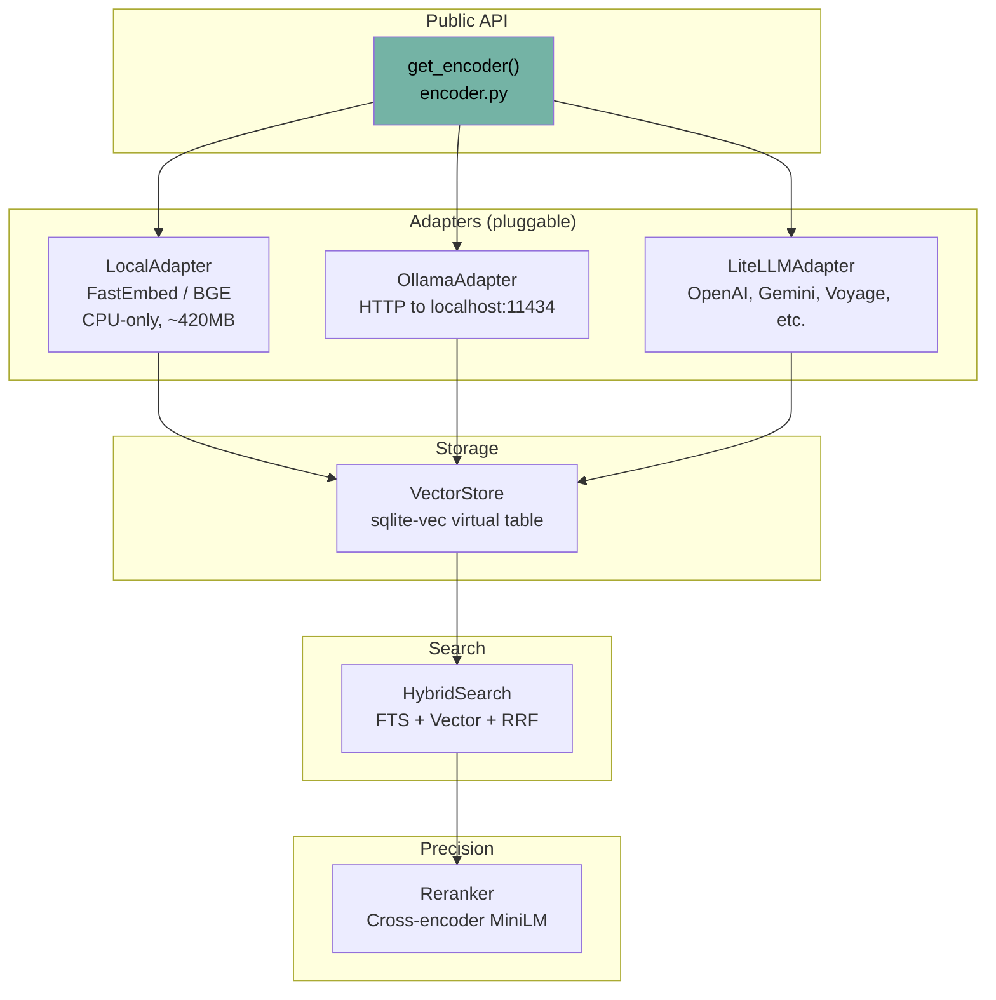
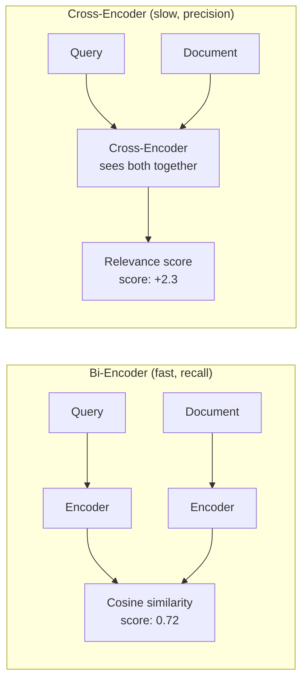

# Embeddings System

The embeddings subsystem powers vector search, similarity detection, intent classification, and cross-encoder reranking. Everything lives in `src/ormah/embeddings/`.

## Architecture



## Embedding Adapter Interface

**Code**: `embeddings/base.py`

```python
class EmbeddingAdapter(ABC):
    @abstractmethod
    def encode(self, text: str) -> np.ndarray:
        """Single text → L2-normalized vector"""

    def encode_batch(self, texts: list[str]) -> list[np.ndarray]:
        """Batch encoding (default: sequential)"""

    def encode_query(self, text: str) -> np.ndarray:
        """Query-specific encoding (may add prefix)"""

    @property
    @abstractmethod
    def dim(self) -> int:
        """Vector dimensionality"""
```

## Local Adapter (Default)

**Code**: `embeddings/local_adapter.py`

- **Model**: BAAI/bge-base-en-v1.5
- **Dimensions**: 768
- **Library**: FastEmbed (ONNX runtime, CPU-only)
- **Size**: ~420MB download on first use
- **Cache**: `~/.local/share/ormah/models/`

```python
# Query encoding adds special prefix automatically
model.query_embed("what database does ormah use?")
# → internally: "Represent this sentence for searching relevant passages: what database does ormah use?"

# Document encoding (no prefix)
model.embed("Chose SQLite over Postgres for local-first design")
```

**Lazy loading**: Model is downloaded and loaded on first `encode()` call. Subsequent calls use a module-level `_model_cache` singleton keyed by model name.

### Why BGE?

- Runs entirely on CPU (no GPU needed)
- 768 dimensions gives good precision without excessive storage
- Asymmetric retrieval: different encoding for queries vs documents improves recall
- ~420MB is acceptable for a local-first tool

## Ollama Adapter

**Code**: `embeddings/ollama_adapter.py`

For users running Ollama locally:

```python
# HTTP POST to http://localhost:11434/api/embed
response = httpx.post(f"{base_url}/api/embed", json={
    "model": "nomic-embed-text",  # default
    "input": [text]
})
```

- Batch processing with 32-item chunks
- Auto-normalization of returned vectors

## LiteLLM Adapter

**Code**: `embeddings/litellm_adapter.py`

For cloud-hosted embeddings (OpenAI, Gemini, Voyage, Mistral):

```python
# Uses litellm's unified interface
response = litellm.embedding(model="text-embedding-3-small", input=[text])
```

- Batch processing with 32-item chunks
- Auto-normalization

## Encoder Factory

**Code**: `embeddings/encoder.py`

```python
def get_encoder(settings: Settings) -> EmbeddingAdapter:
    if settings.embedding_provider == "local":
        return LocalAdapter(model=settings.embedding_model)
    elif settings.embedding_provider == "ollama":
        return OllamaEmbeddingAdapter(model=settings.embedding_model)
    elif settings.embedding_provider == "litellm":
        return LiteLLMEmbeddingAdapter(model=settings.embedding_model)
```

Module-level `_adapter_cache` keyed by `id(settings)` ensures a singleton per settings object.

## Vector Store

**Code**: `embeddings/vector_store.py`

Wraps the `sqlite-vec` extension for vector storage and KNN search:

```python
class VectorStore:
    def upsert(self, node_id: str, embedding: np.ndarray):
        """DELETE + INSERT in single transaction"""
        # Atomic: prevents reader seeing missing row

    def search(self, query_vec: np.ndarray, k: int) -> list[dict]:
        """KNN via sqlite-vec MATCH operator"""
        # SELECT id, distance FROM node_vectors
        # WHERE embedding MATCH ? AND k = ?
        # Returns L2 distance, converted:
        # cosine_similarity = 1 - (distance² / 2)

    def upsert_batch(self, items: list[tuple[str, np.ndarray]]):
        """Batch upsert in single transaction"""
```

### L2 to Cosine Conversion

sqlite-vec uses L2 (Euclidean) distance internally. For L2-normalized vectors (unit vectors), cosine similarity can be derived:

```
cosine_similarity = 1 - (L2_distance² / 2)
```

This works because for unit vectors: `||a - b||² = 2 - 2·cos(a,b)`, so `cos(a,b) = 1 - ||a-b||²/2`.

## Cross-Encoder Reranker

**Code**: `embeddings/reranker.py`

A precision filter used exclusively in the whisper pipeline. Unlike embeddings (which encode query and document separately), the cross-encoder sees both together.

### How It Works



**Model**: `cross-encoder/ms-marco-MiniLM-L-6-v2`
- Input: (query, document) pairs
- Output: raw score in [-12, +6] range
- Positive = relevant, negative = irrelevant

### Linear Rescale

```python
def _linear_rescale(ce_score: float) -> float:
    """Maps [-12, +6] → [0, 1] linearly"""
    return max(0.0, min(1.0, (ce_score - (-12)) / (6 - (-12))))
```

Linear rescale (not sigmoid) is used because it preserves the cross-encoder's ability to **strongly suppress** irrelevant results. Sigmoid would flatten the extremes, reducing discrimination.

### Blending

```python
final_score = alpha * linear_rescale(ce_score) + (1 - alpha) * embedding_score
# alpha = 0.6 (60% cross-encoder weight)
```

## Model Cache

**Code**: `embeddings/cache.py`

```python
def get_fastembed_cache_dir() -> Path:
    """~/.local/share/ormah/models/ or FASTEMBED_CACHE_PATH env"""

def is_model_cached(model_name: str) -> bool:
    """Check if model directory exists"""
```

During `ormah setup`, both the embedding model and reranker model are preloaded so the first whisper call doesn't have a cold-start delay.

## Content Truncation

Before embedding, content is truncated to `embedding_max_content_chars` (default: 512 characters). This prevents long documents from getting "averaged out" embeddings that match everything weakly.

```python
text_to_embed = f"{title}\n{content[:512]}" if title else content[:512]
```

## Walkthrough: Encoding and Searching

Say we store: "Chose SQLite over Postgres because local-first doesn't need a server database"

1. **Encoding**: `LocalAdapter.encode("Chose SQLite over Postgres...")` → 768-dim normalized vector
2. **Storage**: `VectorStore.upsert(node_id, vector)` → INSERT into sqlite-vec
3. **Later, search**: User asks "what database does ormah use?"
4. **Query encoding**: `LocalAdapter.encode_query("what database does ormah use?")` → 768-dim query vector (with "Represent this sentence..." prefix)
5. **KNN search**: `VectorStore.search(query_vec, k=30)` → returns L2 distances
6. **Convert**: `cosine_sim = 1 - (distance² / 2)` → 0.82 for "Chose SQLite..."
7. **Threshold**: 0.82 > 0.4 → passes
8. **Feed into HybridSearch**: Combined with FTS5 results via RRF (see [03 - Search and Ranking](<./03 - Search and Ranking.md>))
