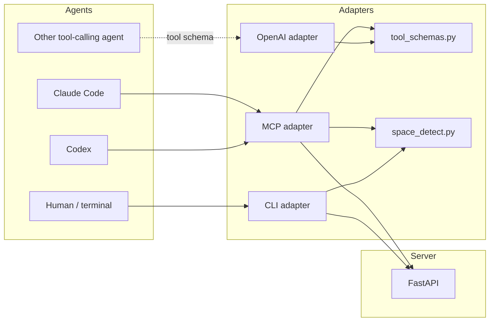

# MCP and Adapters

Verified against the current repository state on 2026-04-07.

Ormah exposes the same core memory engine through several adapter layers:

- MCP for supported MCP clients such as Claude Code and Codex
- a synchronous CLI HTTP adapter
- an OpenAI-style schema exporter for tool-calling agents

The core engine is not Claude-specific. What differs between clients is mostly setup and transport glue.

## Adapter Architecture

## MCP Adapter

**Code**: `src/ormah/adapters/mcp_adapter.py`

The MCP adapter is a stdio server that proxies tool calls to the local HTTP API.

### What it exposes

MCP currently lists only the **6 core agent tools** from `TOOLS`:

- `remember`
- `recall`
- `recall_node`
- `mark_outdated`
- `submit_feedback`
- `run_maintenance`

This is an important distinction:

- `TOOLS` = 6 core agent tools
- `ADMIN_TOOLS` = 7 human/admin tools
- `ALL_TOOLS` = combined list used by the OpenAI adapter

So the docs should not say that the MCP `list_tools` call exposes all 13 tools. It does not.

### How MCP maintenance works

`run_maintenance` is special:

1. phase 1: MCP calls `/agent/maintenance` with `{}` and gets raw JSON batches back
2. MCP formats those batches into readable text with `_format_maintenance_batches()`
3. phase 2: the agent submits `results`
4. MCP posts those results back to `/agent/maintenance`

The formatting happens in the adapter, not in the API route itself.

## Tool Schemas

**Code**: `src/ormah/adapters/tool_schemas.py`

`tool_schemas.py` is the canonical definition source.

### Agent tools

These are the tools exposed through MCP.

### Admin tools

These are available for admin/API/OpenAI-style usage, but not listed by the MCP server today.

### Combined export

The OpenAI adapter exports `ALL_TOOLS`, so OpenAI-style integrations can use the full set rather than just the 6 MCP tools.

## CLI Adapter

**Code**: `src/ormah/adapters/cli_adapter.py`

The CLI adapter is a synchronous HTTP client around the same API.

Common commands:

- `ormah recall`
- `ormah remember`
- `ormah node`
- `ormah outdated`
- `ormah ingest`
- `ormah ingest-session`
- `ormah stats`
- `ormah whisper inject`
- `ormah whisper store`
- `ormah whisper setup`

## Whisper Hook Commands

### `ormah whisper inject`

This command:

1. reads hook JSON from stdin
2. extracts `prompt`, `cwd`, and `session_id`
3. detects `space` from the hook-provided cwd
4. calls `POST /agent/whisper`
5. returns `additionalContext` JSON back to the calling hook client
6. increments a per-session counter in `~/.cache/ormah/whisper-cursors.json`
7. may append a nudge
8. may spawn `ormah whisper store` periodically in the background

It is intentionally fail-fast and silent on server / timeout failures so it never blocks the user prompt path.

Today, both Claude Code and Codex install this same CLI hook command during setup.

### `ormah whisper store`

This command:

1. reads hook JSON from stdin
2. resolves the transcript path from the provided path or `session_id`
3. loads a byte-offset cursor from `~/.cache/ormah/whisper-cursors.json`
4. parses only new transcript content since the last offset
5. skips extraction if there are too few user turns or no new text
6. posts the parsed conversation to `/ingest/conversation` with `extra_tags=whisper-out`
7. updates the cursor only after a successful extraction

The transcript resolver currently checks both:

- `~/.claude/projects`
- `~/.codex/sessions`

## Whisper Setup Helper

`ormah whisper setup` writes Claude Code hook configuration.

- local target: `.claude/settings.local.json`
- global target: `~/.claude/settings.json` when `--global` is used

This helper is Claude-specific. Codex hook setup is handled through `ormah setup`, which writes `~/.codex/hooks.json`.

## OpenAI Adapter

**Code**: `src/ormah/adapters/openai_adapter.py`

The OpenAI adapter does not talk to the server directly. It exports tool schemas in OpenAI function-calling format.

That means:

- transport is up to the caller
- schema set is `ALL_TOOLS`
- it is a schema conversion layer, not a runtime proxy like MCP

### What it is for

This adapter exists for developers building their own OpenAI-style tool-calling agent around Ormah.

Typical use:

1. call `get_openai_tools()`
2. pass those tool definitions into the OpenAI SDK / Responses API / tool-calling model
3. when the model chooses a tool, your application executes the corresponding Ormah API call

So this adapter helps with **tool declaration**, not **tool execution**.

### Who uses it

- a custom app using the OpenAI SDK
- a tool-calling agent stack that wants OpenAI-format tool schemas instead of MCP

### Who does not use it directly

- Claude Code via MCP
- the Ormah CLI
- the MCP server itself

In the current repo, this adapter is mostly an integration helper. It exists and is accurate, but it is not a major internal runtime path like the MCP adapter.

## Space Detection

**Code**: `src/ormah/adapters/space_detect.py`

Space resolution is shared by MCP and CLI paths:

1. explicit value when provided
2. `ORMAH_SPACE` env override
3. git top-level directory name
4. cwd basename fallback

## Walkthrough: MCP client calls `remember`

1. Claude Code or Codex decides to call `remember`
2. MCP receives the stdio tool call
3. MCP adds default space context when needed
4. MCP posts to `/agent/remember`
5. FastAPI route delegates to `MemoryEngine.remember()`
6. MCP converts the HTTP response back into `TextContent`

## Code Anchors

- `src/ormah/adapters/mcp_adapter.py`
- `src/ormah/adapters/cli_adapter.py`
- `src/ormah/adapters/openai_adapter.py`
- `src/ormah/adapters/tool_schemas.py`
- `src/ormah/adapters/space_detect.py`
