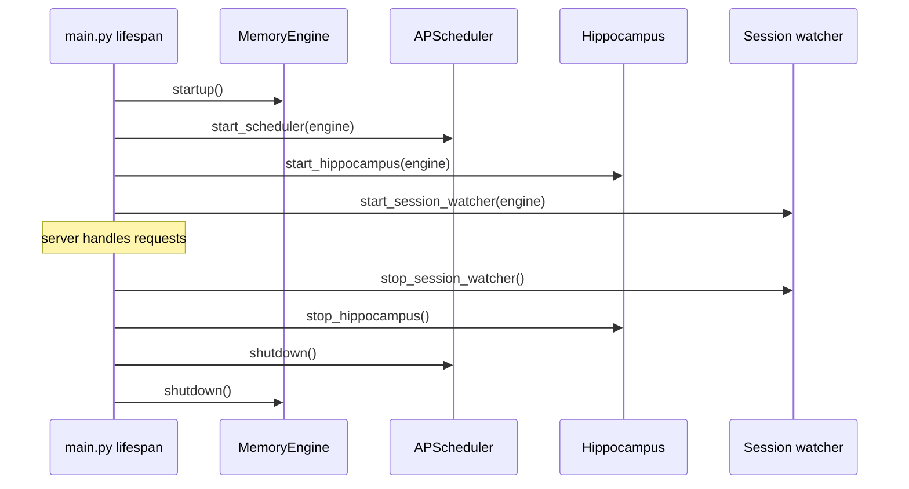
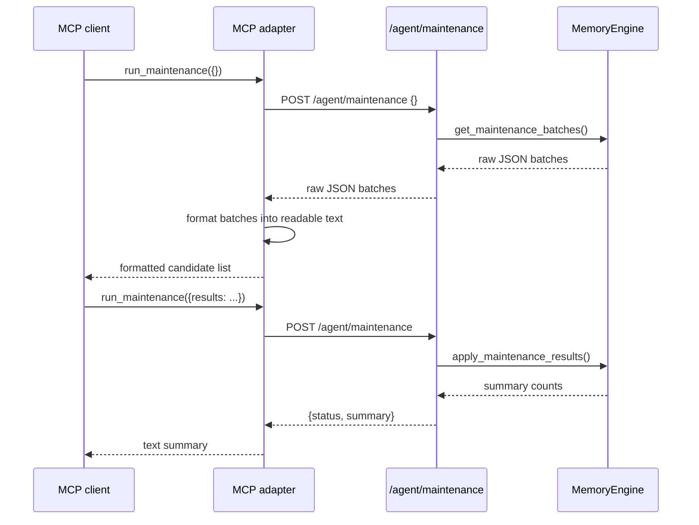

# API Surface

Verified against the current repository state on 2026-04-07.

The Ormah server is a FastAPI app on `localhost:8787`. Routes are grouped into `/agent`, `/admin`, `/ingest`, and `/ui`.

These routes are client-agnostic HTTP surfaces. Claude Code and Codex both call into the same backend API, and other clients can do the same.

## Application Lifecycle



Important nuance:

- hippocampus startup returns no observers unless it is enabled **and** watch dirs are configured
- session watcher startup returns no observers unless it is enabled

## Middleware

`src/ormah/api/middleware.py` adds agent-id extraction and request logging. CORS is open for local use.

## Agent Routes

**Code**: `src/ormah/api/routes_agent.py`

### Text-style routes

These return a JSON envelope shaped like:

```json
{"text": "...", "node_id": "...optional..."}
```

Routes in this group include:

- `POST /agent/remember`
- `POST /agent/recall`
- `GET /agent/recall/{node_id}`
- `POST /agent/update/{node_id}`
- `DELETE /agent/recall/{node_id}`
- `POST /agent/connect`
- `POST /agent/whisper`
- `POST /agent/feedback`
- `POST /agent/outdated/{node_id}`
- `POST /agent/merges/{merge_id}/undo`

### Structured JSON routes

These do **not** return the formatted text envelope:

- `GET /agent/insights`
- `GET /agent/proposals`
- `POST /agent/proposals/{proposal_id}`
- `POST /agent/maintenance`
- `GET /agent/merges`
- `GET /agent/audit`

So the old blanket statement "agent routes return formatted text, not raw JSON" is too broad.

## Whisper Endpoint

`POST /agent/whisper` expects a JSON body with:

- `prompt`
- optional `space`
- optional `session_id`

The route also maintains an in-memory recent-prompt buffer by session id before delegating to `MemoryEngine.get_whisper_context()`.

## Maintenance Endpoint

`POST /agent/maintenance` is a two-phase endpoint.

### Phase 1

Send `{}`.

The route calls `engine.get_maintenance_batches()` and returns raw JSON batches:

- `link_candidates`
- `conflict_candidates`
- `merge_candidates`
- `consolidation_clusters`
- `summary`

### Phase 2

Send:

```json
{"results": {...}}
```

The route calls `engine.apply_maintenance_results()` and returns:

```json
{"status": "applied", "summary": {...}}
```

The important implementation detail is that **MCP formats phase-1 batches into readable text**. The HTTP route itself does not.

## Admin Routes

**Code**: `src/ormah/api/routes_admin.py`

Available routes:

- `GET /admin/health`
- `GET /admin/stats`
- `POST /admin/rebuild`
- `GET /admin/tasks`
- `POST /admin/tasks/{task_id}/run`
- `POST /admin/tasks/run-all`
- `POST /admin/tasks/{task_id}/pause`
- `POST /admin/tasks/{task_id}/resume`
- `POST /admin/tasks/pause-all`
- `POST /admin/tasks/resume-all`

### Sleep-cycle order

`run-all` executes tasks in this order:

```text
importance_scorer
-> index_updater
-> duplicate_merger
-> conflict_detector
-> auto_linker
-> auto_cluster
-> consolidator
-> decay_manager
```

`index_updater` is part of the run-all path even though it is not a standalone imported background module in `_TASK_RUNNERS`.

## Ingest Routes

**Code**: `src/ormah/api/routes_ingest.py`

Routes:

- `POST /ingest/conversation`
- `POST /ingest/file`

These are used by bulk ingestion, whisper-out, hippocampus, and the session watcher.

## UI Routes

**Code**: `src/ormah/api/routes_ui.py`

Routes:

- `GET /ui/graph`
- `GET /ui/graph/node/{node_id}`
- `GET /ui/search`
- `GET /ui/insights`
- `WS /ui/ws` placeholder

### `GET /ui/graph` response shape

```json
{
  "nodes": [{"id": "...", "type": "fact", "title": "..."}],
  "edges": [
    {
      "source_id": "...",
      "target_id": "...",
      "edge_type": "related_to",
      "weight": 0.7,
      "created": "..."
    }
  ],
  "user_node_id": "..."
}
```

The edge keys are `source_id`, `target_id`, and `edge_type`, not `source`, `target`, and `type`.

## Response Format Summary

| Route family | Typical shape |
|---|---|
| Most `/agent` write/read routes | `{text, node_id?}` |
| `/agent/maintenance`, `/agent/proposals`, `/agent/insights`, `/agent/merges`, `/agent/audit` | structured JSON |
| `/admin/*` | structured JSON |
| `/ui/*` | structured JSON |

## Walkthrough: maintenance via MCP



## Code Anchors

- `src/ormah/main.py`
- `src/ormah/api/routes_agent.py`
- `src/ormah/api/routes_admin.py`
- `src/ormah/api/routes_ingest.py`
- `src/ormah/api/routes_ui.py`
