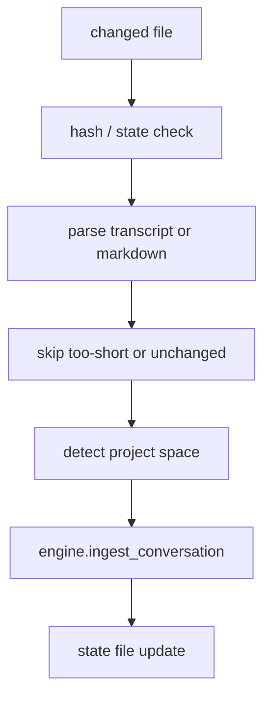

# Hippocampus and Session Watcher

Verified against the current repository state on 2026-04-13.

These are two separate watcher systems:

- **Hippocampus** watches configured markdown directories and ingests changed files
- **Session watcher** watches transcript directories and ingests completed sessions

They are separate from the node-store watcher in `src/ormah/store/watcher.py`, which is not started by the app runtime.

## Hippocampus

**Code**: `src/ormah/background/hippocampus.py`

Hippocampus watches configured external markdown directories, not Ormah's own node directory.

### Startup conditions

Hippocampus only starts when both are true:

- `hippocampus_enabled == True`
- `hippocampus_watch_dirs` is non-empty

Current default:

- `hippocampus_enabled = True`
- `hippocampus_watch_dirs = []`

So the effective out-of-the-box behavior is "enabled in principle, but inactive until watch dirs are configured".

### What it does

1. performs a catch-up scan of each watch dir
2. computes hashes to skip unchanged files
3. filters ignored paths
4. detects space from repo / directory context
5. calls `engine.ingest_conversation(...)`
6. persists a `.hippocampus_state` file per watch dir
7. starts real-time watchdog observers

Ignored-path filtering is configurable through `hippocampus_ignore_patterns`.

## Session Watcher

**Code**: `src/ormah/background/session_watcher.py`

The session watcher ingests transcript JSONL files.

### Startup conditions

It only starts when:

- `session_watcher_enabled == True`
- the configured watch dir exists

Current defaults:

- `session_watcher_enabled = False`
- `session_watcher_dir = ~/.claude/projects`
- `session_watcher_debounce_seconds = 60`
- `session_watcher_min_turns = 5`
- `session_watcher_lookback_hours = 72`

The current default watch directory is a concrete Claude Code path, not an auto-detected one.

### What it does

1. scans for changed `.jsonl` files
2. applies first-run lookback filtering
3. parses transcripts into conversation text
4. skips very short sessions
5. derives space from encoded parent directory names
6. ingests the conversation through `engine.ingest_conversation(...)`
7. stores `.session_watcher_state`
8. starts a real-time observer

## Transcript Parser

**Code**: `src/ormah/transcript/parser.py`

The parser now supports **both Claude Code and Codex-style JSONL transcripts**.

That parser support is broader than the session watcher's current default setup: the parser can normalize both formats, while the watcher's default directory and space-decoding logic are still Claude-Code-shaped.

Supported normalized sources:

- Claude Code entries with `type: "user"` / `type: "assistant"`
- Codex-style `response_item` message entries

It extracts:

- user text blocks
- assistant text blocks

And skips:

- tool-only blocks
- tool results
- non-message payloads
- bootstrap/environment context

## Flow

## Example Walkthrough

Session watcher example:

1. a new session file appears under `~/.claude/projects/-Users-username-Personal-ormah/...jsonl`
2. watcher debounces changes
3. parser extracts cleaned conversation text
4. parent directory name is decoded and the last path segment becomes `ormah`
5. Ormah ingests the conversation as candidate memories
6. state is updated so the same file is not reprocessed unnecessarily

## Code Anchors

- `src/ormah/background/hippocampus.py`
- `src/ormah/background/session_watcher.py`
- `src/ormah/transcript/parser.py`
