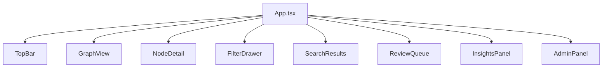

# Web UI

Verified against the current repository state on 2026-04-07.

Ormah includes a small React + TypeScript graph explorer served by FastAPI.

## Stack

- React
- TypeScript
- Vite
- Cytoscape.js
- cytoscape-cola

## Main Components



## Data Flow

1. `App.tsx` loads `/ui/graph`
2. graph data is filtered client-side
3. node selection triggers `/ui/graph/node/{id}`
4. search uses `/ui/search`
5. proposals and admin actions use `/agent/*` and `/admin/*`

## Implemented Visual Rules

### Node colors

Implemented:

- self node: teal
- identity node: darker teal
- core: gold
- working: dark gray
- archival: very dark gray

### Edge colors

Currently special-cased:

- `supports`
- `contradicts`
- `defines`
- `evolved_from`

All other edge types currently fall back to a generic dark gray line color.

So docs should not claim dedicated colors for `part_of` and `depends_on` unless the UI is updated to match.

### Node sizing

Node size is based on access count:

```text
24 + log2(access_count + 1) * 6
```

bounded to a minimum / maximum size, with the self node forced a bit larger.

### Edge opacity

Edge opacity is derived from:

```text
max(0.2, weight or 0.5)
```

## Panels

### Filter drawer

Implemented filters:

- tier
- type
- space
- edge type
- group-by-space toggle

The drawer shows per-filter counts, but there is no separate statistics overview panel rendered there today.

### Node detail

Currently shown:

- title
- short id
- tier badge
- type
- optional space
- tags
- access count
- last accessed time-ago text
- full content
- clickable connection list

Not currently shown in the rendered panel:

- created timestamp
- updated timestamp
- importance
- confidence
- stability

### Admin panel

Currently implemented:

- fetch background tasks from `/admin/tasks`
- run one task
- run sleep cycle
- pause / resume one task
- pause / resume all

Not currently rendered:

- rebuild-index button
- stats panel, even though `fetchStats()` exists in the API layer

## API Shapes Used By The UI

The graph UI expects edge objects shaped like:

```json
{
  "source_id": "...",
  "target_id": "...",
  "edge_type": "supports",
  "weight": 1.0
}
```

`GraphView.tsx` then maps those into Cytoscape edge `source` / `target` fields on the frontend.

## Walkthrough Example

If you click a node in the graph:

1. `GraphView` reports the selected node id
2. `App` fetches `/ui/graph/node/{id}`
3. `NodeDetail` renders the node metadata, access info, and connected neighbors
4. clicking a connection loads the connected node into the same detail view

## Code Anchors

- `ui/src/components/GraphView.tsx`
- `ui/src/components/NodeDetail.tsx`
- `ui/src/components/FilterDrawer.tsx`
- `ui/src/components/AdminPanel.tsx`
- `ui/src/api.ts`
