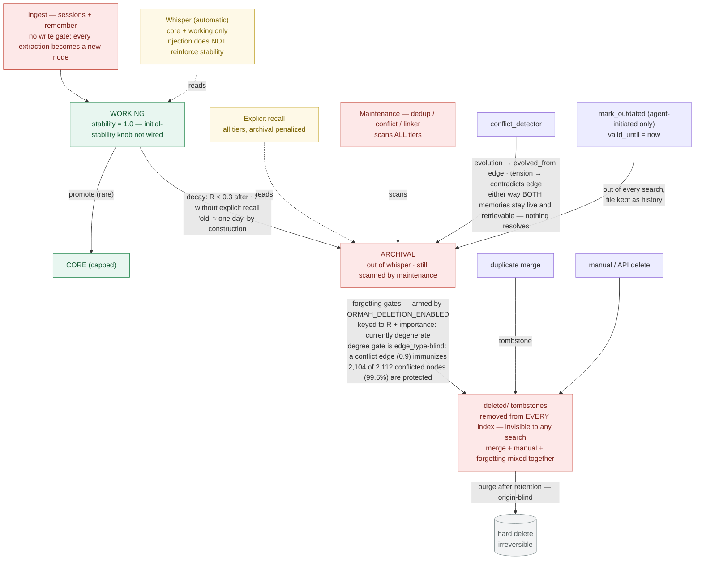
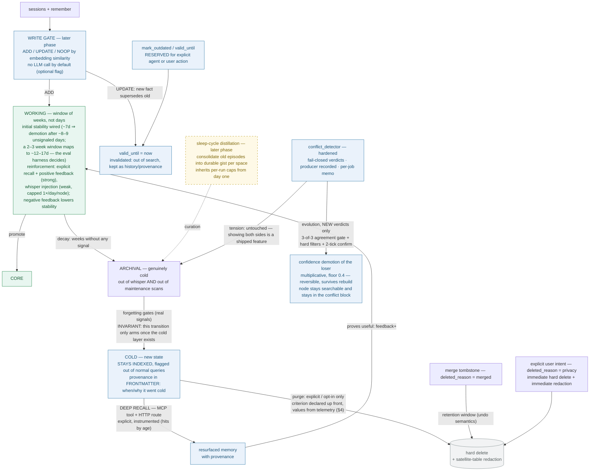

# Proposal — Memory lifecycle: clock calibration, cold layer, and Deep Recall

*Context: #28 / PR #31 review discussion. Companion to the PR reply; self-contained. Diagrams are mermaid and render natively on GitHub. (v3 — revised after measuring v2's claims against a live 31,647-node store and against the current model.)*

> **What changed in v3.** Three v2 claims did not survive measurement, and the conflict phase is redesigned as a result:
> 1. **The forgetting protection gate is not "paper armor"** — it protects 99.6% of conflicted nodes today. Its defect is different: `_connectivity` computes `MAX(weight)` **without looking at `edge_type`**, so a `contradicts` edge at 0.9 immunizes a node exactly like a `supports` edge would. A conflict is currently a *reason to keep* a node forever.
> 2. **Auto-`mark_outdated` for evolution conflicts is withdrawn.** Reading the content of all 86 divergent pairs plus a 20-pair concordant control: even when the model *and* the creation-date ordering agree, only ~50% of resolutions would be correct — 40% of those pairs are not evolution at all, just thematic conflation. A destructive-adjacent write at 50% precision is indefensible. Replaced by reversible confidence demotion.
> 3. **The existing 1,452 conflict edges are not a resolvable backlog.** Re-judging historical `evolved_from` pairs with the current local model reproduces the verdict in 1 of 10. Any resolution applies to *new* verdicts from a hardened pipeline only; the historical stock is never batch-resolved.
>
> Full evidence, including the executable tests, is summarized in §7.

## 1. Problem

Two independent roots, plus one confession:

1. **The lifecycle clock is uncalibrated.** Every node is created with the default `stability = 1.0` — the `fsrs_initial_stability` setting exists but is never wired into node creation. Stability only grows on *explicit* recall (whisper injections don't count as access), which is rare by design. With `fsrs_decay_threshold = 0.3`, `R = exp(-t/1.0)` crosses the threshold after **~29 hours**: a node not explicitly recalled within a day of creation becomes a decay candidate, by construction. "Archival" therefore means *older than a day or two*, not *long-tail stale* — and every forgetting gate keyed to retrievability or importance is currently selecting on noise (any node past `deletion_min_archival_days` has R ≈ 0; importance scores in practice don't reach the protection thresholds). Fixing the knob alone is not enough: thousands of already-persisted nodes carry the broken `stability = 1.0` and would keep the broken clock forever — the stock needs a one-shot migration, not just the flow.
2. **`deleted/` conflates three different things.** Merge tombstones (undo semantics), manual deletes, and forgetting output all land in the same directory, and soft-delete removes the node from the index entirely — so a future "cold layer" built on it would be invisible to any search, and the purge job is origin-blind.
3. **Part of the original push for deletion was #22**: the graph view becomes unusable on a large store, so "fewer nodes" looked like the fix. The right fix is the renderer (see §6) — which decouples the UI pain from the lifecycle decision.

## 2. Current lifecycle

One more honesty note about today's "hard delete": it is not complete. Full-node snapshots persist indefinitely in `audit_log.node_snapshot` and `merge_history.removed_node_snapshot`, and injected `whisper_log` rows retain the raw prompt text — no purge job touches any of these. §4 addresses this.

## 3. Proposed lifecycle

## 4. Design points

**Reinforcement hierarchy (clock calibration).** Stability grows from a hierarchy of signals rather than explicit recall alone: explicit recall and positive feedback are strong reinforcement; whisper injection is weak reinforcement, capped per `(node_id)` per day to avoid a rich-get-richer loop; negative feedback *lowers* stability, giving the clock its missing failure signal. `fsrs_initial_stability` gets wired, and — critically — a **one-shot migration recalculates `stability` for already-persisted nodes** (same pattern as the existing `archived_at` legacy backfill), so the fix reaches the stock, not just future writes. Two honest caveats, telemetry-tracked rather than hand-waved: the cap limits reinforcement *magnitude* but not the exposure-bias loop (injected nodes rank better, get injected more) — the eval harness measures stability concentration in the top-k to verify the cap suffices; and feedback arrival is agent-dependent (agents must call `submit_feedback`; the transcript-mining LLM judge is the only agent-independent signal and stays off by default for local-LLM users) — per-agent cooling rates are part of the calibration telemetry before the knob value is final. The importance-scorer revisit has a declared shape as well: measure the per-type score distribution, then rescale the scorer's output so the existing protection thresholds fall inside the observed range — thresholds keep their semantic meaning; the scorer moves.

**Cold is a state, not a tombstone.** Forgetting transitions archival → cold: the node stays in the index, flagged out of normal recall and out of maintenance scans, with provenance (when/why) stamped **in frontmatter — the file remains the source of truth**, following the `archived_at` pattern point-by-point (index column + migration + `full_rebuild` insert list + backfill task), since each of those steps missed means the field silently reverts on rebuild. Excluding cold and archival from maintenance scans is where the accumulating operational cost actually bites; it shrinks the maintenance working set to the active tiers. `Tier.cold` is a schema-visible change (backend enum + UI type union + external MCP clients). The compatibility contract is concrete: the enum change is **additive** — API/MCP responses may carry a tier value older clients don't know, and the documented behavior is to treat an unknown tier as archival-like rather than fail validation; MCP tool schemas update in the same PR, and the UI sits behind a feature flag until the frontend supports the new state.

**Deep Recall is a surface with a declared trigger, not a hope.** It ships as an MCP tool **and** an HTTP route (mirroring `recall`), agent-agnostic from day one. Its tool description tells the model *when* to reach for it — normal recall returned weak/empty results and the question references past context — and a server-side auto-escalation (deep recall suggested when normal recall confidence is low) is evaluated in the same PR. Deep-recall usage telemetry (calls, hits, hit age) is part of the PR, because a cold layer nobody queries is dead code — the same criticism this proposal makes of today's invisible tombstones. Search runs on embedding similarity over the cold partition; no LLM call by default.

**`deleted_reason` splits the tombstone semantics.** Merge and manual tombstones remain a pure undo/purge queue (retention window, then hard delete — as today). Forgetting no longer writes there at all. Pre-existing tombstones without the field get `deleted_reason = "legacy_unknown"` and the most conservative policy: never auto-purged. The `archival_soft_cap` backstop is dropped — bypassing the staleness gates to hit a count is indefensible as-is, and no count-based eviction returns without explicit staleness semantics.

**Conflicts stop tying the lifecycle in a knot — by demotion, not invalidation.** Three measured facts drive this, all of them contradicting the shape v2 proposed.

*First, a conflict currently makes a node immortal.* The forgetting protection gate reads `MAX(weight)` over a node's edges with no `edge_type` predicate, and conflict edges carry a fixed `weight = 0.9` — above the `deletion_strong_edge_weight` threshold of 0.7. Measured: **2,104 of 2,112 conflicted nodes (99.6%) are protected**, and a unit test confirms a node whose only edge is `contradicts@0.9` survives forgetting exactly as if it were `supports@0.9`. Being contradicted is currently indistinguishable from being corroborated. The fix is one predicate in `_connectivity`: structural edges corroborate, conflict edges do not.

*Second, automatic invalidation cannot be justified at the precision available.* I read the content of all 86 `evolved_from` pairs where the model's direction disagrees with the `created` ordering, plus a 20-pair concordant control. Restricted to the 60 pairs whose dates differ by more than a day, the model chose the right direction **0 times** — so an agreement gate between the model and `created` is genuinely necessary. But it is not sufficient: in the concordant control only **10 of 20** resolutions were correct, because **8 of 20 pairs are not evolution at all** — thematic conflation (two different knowledge graphs read as one metric evolving). `mark_outdated` removes a node from every search surface through six independent call sites; applying that at ~50% precision would silently delete good memories, and the failure would be invisible by construction. **v2's auto-proposal for `mark_outdated` is withdrawn.**

*Third, demotion already exists, works, and is durable.* `confidence` multiplies the ranking score as `0.4 + 0.6 * confidence` in both read paths — hybrid search and the whisper gate — so it demotes without erasing, with a floor. It is serialized in frontmatter, and a test confirms both the conflict edge and a demoted `confidence` **survive a `full_rebuild`**. So the loser of an evolution conflict loses the tiebreak, keeps its place in search, and keeps appearing in the `Conflicting context` block the traversal formatter already ships. Reversible, no new column, no new storage semantics. The honest caveat: `confidence` is overloaded — ingestion already writes 0.7 by default — so a demotion is not distinguishable from an uncertain extraction. If that ambiguity bites in practice, the answer is a separate field, not a different model.

The resulting contract: **demotion applies only to new `evolved_from` verdicts from a hardened detector**, never to the existing stock. Re-judging historical pairs with the current model reproduces the verdict in 1 of 10, so the 1,452 accumulated edges are not a backlog waiting to be resolved — they are mostly noise from providers that have since been replaced. Gates before any demotion: the model says `evolution` **and** `created` ordering agrees **and** the pair survives hard filters (≥24h apart — 32% of pairs are same-day, where the date is ingestion latency; `preference`/`fact` only, since `observation`/`event`/`decision` are snapshots that record rather than evolve; no pre-existing `related_to`/`supports` edge; one demotion per node per pass) **and** the pair passes twice in consecutive runs. `mark_outdated` stays exactly what it is today: an explicit agent or user action.

Two prerequisites are not optional, because a gate downstream of a fail-open receives garbage already labeled as a decision. The detector defaults an unknown `type` to `tension` and a missing `evolved_node` to `"b"` — the latter elects a loser by positional default. Both are confirmed by unit tests against the real functions, and both must fail closed before any consumer of the verdict ships. Separately, `auto_linker` writes 60.7% of all `contradicts` edges through a generic six-way classifier with none of the conservative conflict prompt behind it, so "conflict edges" is today a mix of two populations with different precision — the producer has to be recorded, or the two routed through one gate. These belong to the detector-quality issue, not to this proposal, but they gate it.

**An honest erasure contract.** Hard delete has two doors — expired merge/manual tombstones, and explicit user intent (`deleted_reason = "privacy"`, immediate, skipping retention) — but the doors are only real if the satellite copies go too. Today they don't: full-node snapshots persist in `audit_log` and `merge_history`, and injected `whisper_log`/`retrieval_events` rows keep prompt text, with no purge job touching any of them. The purge step therefore gains **redaction**: `UPDATE ... SET snapshot/prompt_text = NULL WHERE node_id = ?` across the three satellite tables — audit structure (operation, node id, timestamps) survives; content doesn't. Redaction runs inside a single index transaction, and its PR carries a concurrency test — privacy purge racing a concurrent file save on the same node — so the one erasure path that promises "immediate and hard" does not silently inherit the FileStore lost-update class (#125). Backups are documented as the remaining honest caveat (a purged node can survive in up to N rotating snapshots). Distillation (later phase) must never absorb a node already marked for privacy deletion; privacy runs before the sleep cycle. Until the redaction lands, docs state the gap explicitly rather than claiming complete erasure.

| Origin of dead weight | Treatment | Rationale |
|---|---|---|
| Evolution conflict (new verdicts only) | `confidence` demotion — reversible, still searchable | ~50% precision even at the best gate; demotion loses a tiebreak, invalidation loses a memory |
| Tension conflict | Nothing — both sides stay live | No loser by definition; showing both is a shipped feature |
| Superseded, explicitly | `mark_outdated` by agent or user | The one path where a human or agent took responsibility for the call |
| Merge tombstone | Soft → hard after retention (as today) | Content absorbed by survivor; tombstone is undo only |
| Cooled by forgetting | Cold state — Deep Recall searchable | Deleting destroys the evidence needed to justify deleting |
| Explicit user intent | Hard + immediate satellite redaction | The one case where hard delete is a requirement |
| Legacy tombstone (no reason) | Never auto-purged | Origin unknown → most conservative policy |

**Purge policy has a declared shape, not a "later".** Whether organically-created memories are ever purged is decided with deep-recall telemetry, but the criterion is declared now so it can actually mature: a cold node becomes purge-eligible only after ≥ N days cold, with the cold layer having served ≥ M deep-recall queries in that window and the node never surfacing (values for N/M set from telemetry, not opinion). If cold-partition growth measurably pressures the vector index before the criterion matures, the cold partition moves out of the hot vector index — growth has a named ceiling either way.

**Human-memory sanity check.** Forgetting in humans is loss of *access*, not erasure — effortful, cued retrieval still reaches it, and consolidation (distilling episodes into durable gist) is how the long tail pays rent. Purge has no biological analogue; it's an engineering decision and is justified here as one (hygiene + explicit intent), not as "memory decay".

## 5. Delivery plan (small PRs, replacing the current branch shape)

1. **(a) Clock calibration** — wire `fsrs_initial_stability`; reinforcement hierarchy (incl. negative-feedback signal); **one-shot stability migration for the existing stock**; importance-scorer revisit. Merge gates: a decay-curve regression test (days-to-archival by access pattern) so the knob value is testable, not aspirational, **and** the exposure-bias measurement — stability concentration in the top-k over simulated reinforcement cycles — because an undetected rich-get-richer loop would propagate silently into every later phase. The stock migration is idempotent (per-node guard, crash-safe re-run — the same guarantee the `archived_at` backfill already has). Ships with telemetry on whisper-pool size and per-agent cooling rates, and a documented rollback (revert the knob) if whisper precision degrades before (c) lands.
2. **(b) PR #31 rebuilt clean** from current `main`, slimmed to the transition machinery: gates + atomic guarded soft-delete + retention, `deleted_reason` split (incl. `legacy_unknown` + `privacy` + satellite redaction), cap dropped. **Also carries the `_connectivity` fix**: the degree gate must distinguish structural edges from conflict edges before any forgetting is armed, otherwise being contradicted is a permanent immunity (99.6% of conflicted nodes today). **#123 is a real but low-frequency risk, not a blocker** — measured 150/150 sampled conflict edges have frontmatter backing, and `full_rebuild` fires only on empty index, schema/FTS migration, admin action, backup restore, and desktop protection recovery. The sharp edge is that `full_rebuild` clears `edges` but *not* the memo tables, so an edge lost to a reindex is never re-derived; that pairs with the swallowed frontmatter-write exception in the detector-quality issue. Merge gate: user-facing lifecycle docs are a merge criterion, not a checklist item. **Invariant: the forgetting archival→cold transition ships dark and only arms once (c) exists** — no half-shipped window where forgetting still produces invisible tombstones. `deletion_enabled=False` stays the default (written invariant). (b) also takes the **audit-durability decision as a merge gate**: hard-delete snapshots mirrored into tombstone frontmatter before unlink (recommended), or `audit_log` joins the backup set — decided and implemented here, because the audit table lives only in the index DB, which backups exclude and `full_rebuild` cannot reconstruct.
3. **(c) Cold layer + Deep Recall** — cold state in frontmatter + index (full archived_at-pattern wiring + backfill), exclusion from normal queries and maintenance scans, MCP+HTTP deep-recall surface with declared trigger, restore/promotion on positive feedback, telemetry. Preconditions: **#29** (file-before-index ordering) and **#125** (FileStore write serialization) land first — (c) adds a new concurrent frontmatter writer (promotion), which is exactly the pattern both issues attack; #29 additionally simplifies or removes the TOCTOU guard machinery. Merge gate: deep-recall precision/recall metrics exist in the eval harness (they don't today) over a synthetic corpus with known-cold nodes.
4. **(d) WebGL graph view for #22** — sigma.js + graphology (FA2 layout), active-first loading, per-space drill-down; already running in our fork, offered upstream as a separate PR.
5. **(e) Evolution-conflict demotion** — replaces v2's proposal-to-invalidate. Strictly ordered behind two prerequisites that are *not* part of this proposal but gate it: **(e0)** the detector's fail-closed fixes and space contract (the detector-quality issue), and **(e1)** a per-job verdict memo (#81 — see the coordination note below). Only then: the 3-of-3 agreement gate, hard filters, 2-tick confirmation, and `confidence` demotion of the loser, shipped behind `conflict_auto_resolve_enabled = False`. The memo must land *before* the resolver for a mechanical reason: demoting rewrites the node's markdown, which bumps `seq`, which returns both nodes to the delta — the same feedback class as the #154 rewind. Merge gate to flip the default on: a dry run over ≥100 pairs **from the hardened pipeline**, human-labeled. The historical rates cannot size this: re-judging historical pairs with the current model reproduces 1 in 10.

Every PR carries its explicit settings delta (added/removed knobs) in the PR body.

**Coordination note — #81's premise needs correcting first.** #81 assumes the persistence half of maintenance convergence is already in place via `duplicate_checked` / `conflict_checked`. Neither table exists on `main`: they were introduced on PR #79, which is still open. On `main`, all three maintenance jobs *read* `auto_link_checked` and only `auto_linker` *writes* to it — so `conflict_detector` and `duplicate_merger` skip pairs they never judged, and re-judge forever the ones the linker hasn't reached, recording nothing either way. Measured on a 31,647-node store: of 12,179 belief-vs-belief pairs already registered, 97.6% carry no conflict verdict that anything can observe, because "judged and clean" and "never judged" are indistinguishable without a writer. This makes per-job memos a prerequisite for (e), and it reorders #81 itself: **memo before watermark**, since a watermark narrows the seed set and would shrink the window even further.

## 6. Open questions

1. **Normal recall boundary:** keep explicit recall searching archival (penalized, as today) with whisper active-only and deep recall adding cold — or make normal recall active-only? Preference: keep archival in explicit recall; but this is a product call.
2. **Working-window target:** initial stability ~7d ⇒ unsignaled demotion at ~8–9 days; ~12–17d ⇒ 2–3 weeks. The eval harness decides; the decay-curve regression test in (a) makes whichever value testable.
3. **Distillation (sleep-cycle consolidation)** is sketched as a later phase — worth an issue of its own? (If pursued: inherits per-run caps from day one, and never absorbs privacy-deleted nodes.)
4. **Does a global memory conflict with a project-scoped one?** The detector's prompt says "different spaces → NEVER a conflict", but candidate generation filters space on the seed only (global-only by default) and not on the KNN neighbour — so 45% of the pairs it builds are global × project-scoped, a case the prompt has no rule for. Project-X-vs-project-Y, the case actually forbidden, occurs once in 778 edges. This is a product call before it is a fix: a global preference contradicting a project decision may be the most valuable conflict the system can find. Whatever the answer, prompt and SQL must agree on it.
5. **Is `confidence` overloaded past usefulness?** Ingestion writes 0.7 by default, so a demoted node and an uncertainly-extracted node look identical. Acceptable at the current volume; the exit is a separate `demotion` factor, not a different lifecycle model.

## 7. Evidence behind v3

Everything asserted above was measured on 2026-08-02 against a live 31,647-node store (read-only) and the current local model, or proved by executable test. Not re-derived from the v2 review.

| Claim | How it was verified |
|---|---|
| Protection gate is `edge_type`-blind; 99.6% of conflicted nodes immune | Store query + unit test: node whose only edge is `contradicts@0.9` survives forgetting; same node without the edge is deleted |
| `valid_until` never read by forgetting | `grep` + `inspect.getsource` over `forgetting_manager` — zero mentions; an outdated node never leaves by being outdated |
| Both fail-open defaults are reachable | Unit tests against the real functions and through `run_conflict_detection` with a mocked verdict |
| `confidence` demotes in both read paths and survives `full_rebuild` | Test builds two near-identical nodes, asserts ranking order, then rebuilds the index and re-asserts |
| Model right 0/60 on genuine date inversions; ~50% correct on the concordant control | Manual content classification of all 86 divergent pairs + a seeded 20-pair control |
| Historical stock is not reproducible | Re-ran the real prompt on historical pairs with `gemma3:12b-it-qat`: 1 of 10 `evolved_from` pairs reproduced; 4 of 10 cross-space pairs still judged as conflicts |
| Conflict edges survive rebuild today | 150/150 sampled edges have frontmatter backing; test confirms edge + confidence survive `full_rebuild` |
| #81's premise is inverted | `git grep` over `upstream/main`: the two skip tables have zero occurrences; only `auto_linker` writes the shared table |

Two defects found while verifying, not part of v2 and not yet filed: expired nodes **leak into spread activation** — `get_nodes_batch` does not apply the `_NOT_EXPIRED` predicate that `get_neighbors` and `get_by_tier` do, so a `mark_outdated` node still surfaces as an activated neighbour — and one ingestion batch (2026-07-30) shows degraded extraction quality (JSON leaking into `title`, implausible dates), which inflates the detector's apparent false-positive rate independently of the detector.

Honest limits: the manual classification is one reviewer's reading of truncated content; the live re-run is n=10 per category, so its rates are directional, not population estimates; and `weight = 0.9` is a proxy for "written by the detector" with an estimated ~10% collision against `auto_linker`'s rounded similarities. Every structural claim (the code defects, the missing writer, the `edge_type`-blind gate) is independent of all three.
